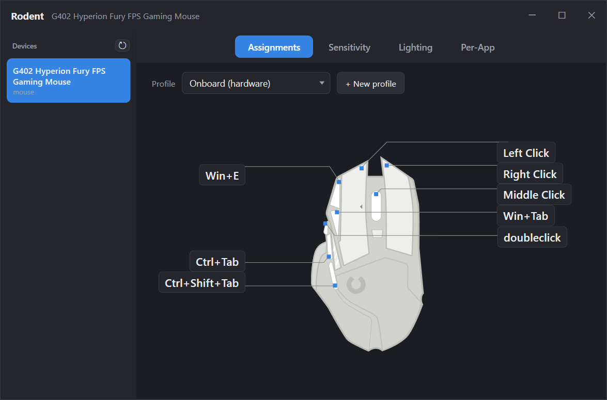

<p align="center">

</p>

**Rodent** is a native Windows manager for Logitech gaming mice — a lightweight
replacement for G HUB, built on the HID++ 2.0 protocol. No cloud, no accounts,
no background bloat: one small WPF app that talks to the mouse directly.

> **Status: work in progress / experimental.** Developed and hardware-verified
> against a single device so far — the **G402 Hyperion Fury**. Other HID++ 2.0
> mice may partially work (feature discovery is generic), but only the G402 has
> been tested end-to-end. Use at your own risk: Rodent writes to the mouse's
> onboard flash memory.

<p align="center">

</p>

## What works today

- **Button assignments** (Assignments tab) — remap any button on the device
  illustration: clicks, key chords, DPI functions, consumer keys, macros.
  Written to the mouse's **onboard profile**, so they work with no software
  running, on any PC.
- **Onboard macros** — G HUB-style macro editor: record keystrokes *and* mouse
  clicks live (layout-correct on any keyboard layout, incl. Turkish Q), typed
  text, key combos, delays; No-Repeat and Repeat-While-Held run from the mouse
  itself.
- **Macro library** — every macro is saved to a local library and can be
  reassigned to any button or profile without rebuilding it.
- **Per-app profiles** (Per-App tab) — software profiles that remap the side
  buttons per foreground application, G HUB style. Implemented with a
  signal-key scheme: side buttons are remapped onboard to F13–F17 and a
  low-level keyboard hook translates them per app. Includes software macros
  with a **safe Toggle repeat** (press again / Esc / 30 s auto-stop — a loop
  that can always be stopped), per-app **lighting**, DPI actions, launch-app,
  media keys, and a G HUB-style command catalog (Task View, emoji panel, etc.).
- **Copy to onboard** — flash a software profile's bindings into the mouse so
  they keep working without Rodent.
- **Sensitivity** (DPI) — G HUB-style DPI slots with default + shift (sniper)
  slot, report rate, written to the onboard profile and applied live.
- **Lighting** — Off / Fixed / Breathing on the logo LED, "mouse default" mode
  with the DPI-stripe indicator (always-lit or blink-on-change), per-profile
  lighting switching. Includes behavior G HUB exposes but does not document —
  reverse-engineered NV config for the DPI strip.
- Device hotplug, tray icon, single-instance, dark UI throughout.

## What doesn't (yet)

- Only wired HID++ 2.0 devices are handled; no Unifying/Bolt receiver pairing.
- Onboard **Toggle** macros are impossible — the G402 firmware cannot cancel a
  running repeat macro (verified; G HUB has the same flaw and its runaway can't
  be stopped). Rodent's Toggle is software-side by design and always stops.
- One onboard profile (the G402 only has one profile sector).
- Not tested on any device other than the G402.

**Note:** quit G HUB / `lghub_agent` before using Rodent — the agent owns the
device and re-syncs its own configuration over anything Rodent writes.

## Layout

```
winapp/
  Rodent.App/    WPF GUI (assignments, macros, DPI, lighting, per-app)
  Rodent.Core/   engine: HID++ transport, onboard profiles, macros, hooks
  Rodent.Probe/  console diagnostics (sector dumps, feature probes, tests)
```

Build with the .NET 8 SDK: `dotnet build winapp/Rodent.App/Rodent.App.csproj`,
or grab the single-file exe from the [Releases] page.

[Releases]: https://github.com/ctnkyaumt/Rodent/releases

## Credits

Rodent stands on the shoulders of open-source projects that documented the
HID++ protocol:

- **[Solaar]** (GPLv2) — this repo started as a fork of it. The HID++ 2.0
  feature protocol, onboard-profile parsing and much of the device logic were
  ported from its `lib/logitech_receiver/` to C#.
- **[libratbag]** (MIT) — the onboard **macro instruction format** and profile
  structures (`src/hidpp20.[ch]`), and the **device SVG illustrations** used on
  the Assignments tab (`data/devices/`).
- **[HidSharp]** (Apache-2.0) — Windows HID transport.
- **[SharpVectors]** (BSD-3-Clause) — SVG rendering in WPF.

Everything else — the Windows port itself, the wire-format fixes it needed
(long-report padding, funcByte convention), the LED/NV reverse engineering,
the signal-key per-app engine and the macro recorder — was built in this repo.

[Solaar]: https://github.com/pwr-Solaar/Solaar
[libratbag]: https://github.com/libratbag/libratbag
[HidSharp]: https://github.com/IntergatedCircuits/HidSharp
[SharpVectors]: https://github.com/ElinamLLC/SharpVectors
